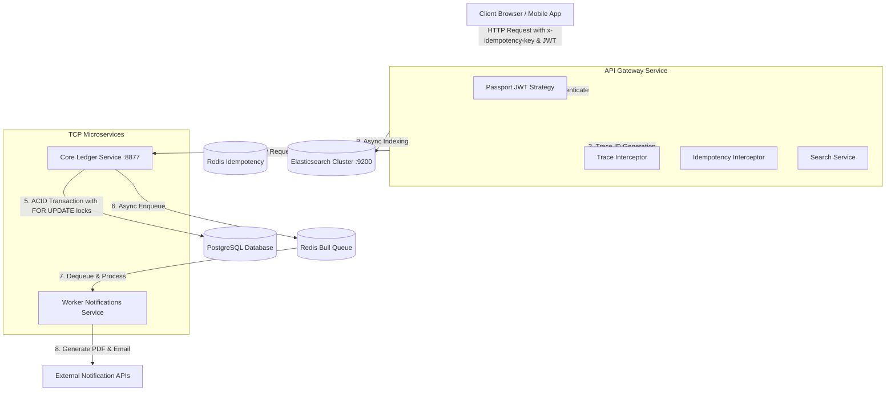
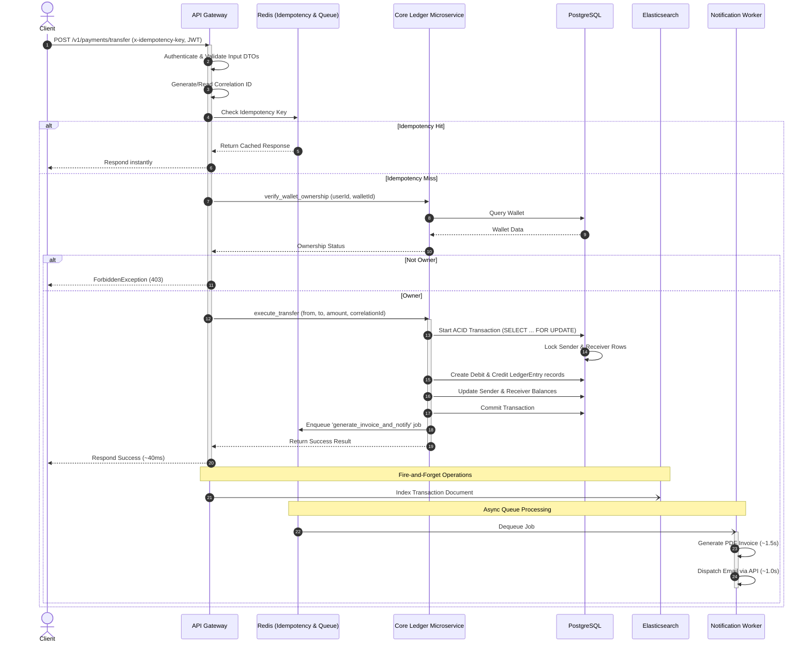
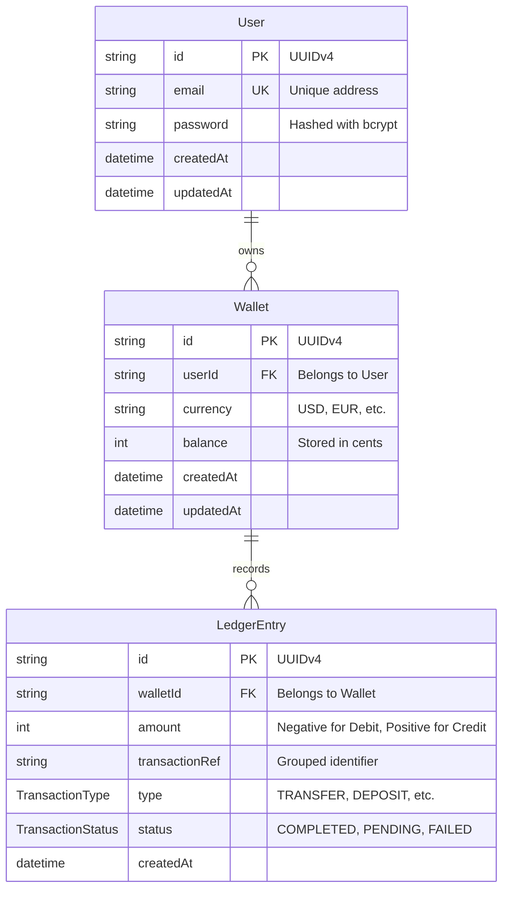

# FinPay — Production-Ready Fintech Payment Platform

A **NestJS microservices monorepo** implementing a production-grade backend for a fintech payment platform. Built to demonstrate enterprise-level backend engineering patterns including double-entry accounting, distributed tracing, async job queues, and full-text search.

---

## 🏗️ System Architecture



---

## 🔄 End-to-End Request Flow & Lifecycles

This sequence diagram details the exact path of a transfer request. It highlights how the API Gateway responds in **~40ms** by delegating long-running notifications and document indexing to async worker processes.



---

## 🛢️ Database Design & Models

FinPay enforces **double-entry ledger accounting** at the database layer. No wallet balance is modified without a matching pair of credit and debit ledger entries that sum to zero.



---

## 🛠️ Key Engineering Decisions

| Category | Solution | Rationale & Trade-offs |
|---|---|---|
| **Financial Integrity** | Double-Entry & ACID Transactions | Wallet balances are aggregates of immutable ledger entries. Every transfer creates a Debit (`-X`) entry and a Credit (`+X`) entry within an ACID block. |
| **Concurrency Control** | Optimistic Row-level Locking (`FOR UPDATE`) | Prevents race conditions (e.g. double-spending) by locking specific user wallet rows during transactions, preventing other read/write operations until commit/rollback. |
| **Fault Tolerance** | Redis-Backed Idempotency | Prevents accidental duplicate payments. If a network call fails, the client retries with the same `x-idempotency-key` and receives the cached response instantly. |
| **Performance Scaling** | Decoupled Async Job Queues | PDF invoice generation and email dispatch are pushed to a Redis queue. The gateway responds to users in ~40ms while workers process CPU/IO heavy tasks. |
| **Observability** | Correlation ID Interceptor | A unique UUID is stamped on the request header and propagated across all services (via HTTP and TCP microservice payloads) for unified log analysis. |
| **Scalable Search** | Elasticsearch Integration | Full-text query engine with fuzzy search matching, separate from the primary transaction database, preventing slow analytical queries from locking transactional data. |

---

## 📁 Monorepo Structure

```
finpay/
├── apps/
│   ├── api-gateway/          # REST Gateway, JWT Authentication, Search Controller, Idempotency Store
│   ├── core-ledger/          # TCP Microservice, Database Transactions, Ledger Service, Prisma Client
│   ├── worker-notifications/ # Bull MQ consumer, PDF generator, email service dispatcher
│   └── finpay/               # Default project entry / stub
├── prisma/
│   └── schema.prisma         # Database schema declaration
└── docker-compose.yml        # Orchestration script for services and databases
```

---

## ⚡ Quick Start (Docker Orchestration)

**Prerequisites**: Docker and Docker Compose installed.

```bash
# 1. Clone the repository
git clone https://github.com/mo74x/finpay.git
cd finpay

# 2. Build and spin up all apps and infrastructure containers
docker compose up --build

# 3. Apply migrations to the PostgreSQL instance (run in a separate terminal)
docker compose exec core-ledger npx prisma migrate deploy
```

- **REST API Endpoint**: `http://localhost:3000`
- **Swagger Documentation**: `http://localhost:3000/api/docs`

---

## ⚙️ Local Development Setup

**Prerequisites**: Node.js 22+, PostgreSQL, Redis, and Elasticsearch running locally.

```bash
# 1. Install dependencies
npm install

# 2. Configure environment variables
cp .env.example .env

# 3. Run migrations and generate Prisma client
npx prisma migrate dev

# 4. Spin up the microservices (in separate terminals or a workspace runner)
npm run start:dev api-gateway
npm run start:dev core-ledger
npm run start:dev worker-notifications
```

---

## 📄 API Specifications

### Authentication API (`auth` tag)

* `POST /v1/auth/register` - Create user account. Returns signed JWT token.
* `POST /v1/auth/login` - Validate credentials. Returns signed JWT token.

```json
// POST /v1/auth/register
{
  "email": "alice@example.com",
  "password": "SecurePassword123"
}
```

### Payments API (`payments` tag)

* `POST /v1/payments/transfer` - Submit a secure double-entry transfer.
  * *Headers Required*: `Authorization: Bearer <JWT>`, `x-idempotency-key: <UUID>`

```json
// POST /v1/payments/transfer
{
  "fromWalletId": "50c0debb-fc7a-4c28-98cc-4d33a1e2f75a",
  "toWalletId": "23d5e2ba-aa7c-47b1-84de-c82ba1e9f1a2",
  "amount": 1000 // In cents (e.g. 1000 = $10.00)
}
```

### Search API (`search` tag)

* `GET /v1/search/transactions` - Fuzzy full-text search across transaction ref and wallet ID logs.
  * *Query Options*: `query`, `status`, `minAmount`, `maxAmount`, `from`, `size`
* `GET /v1/search/transactions/:ref` - Point-lookup a single transaction by reference.
